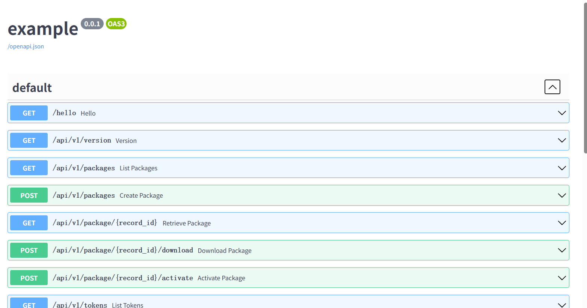
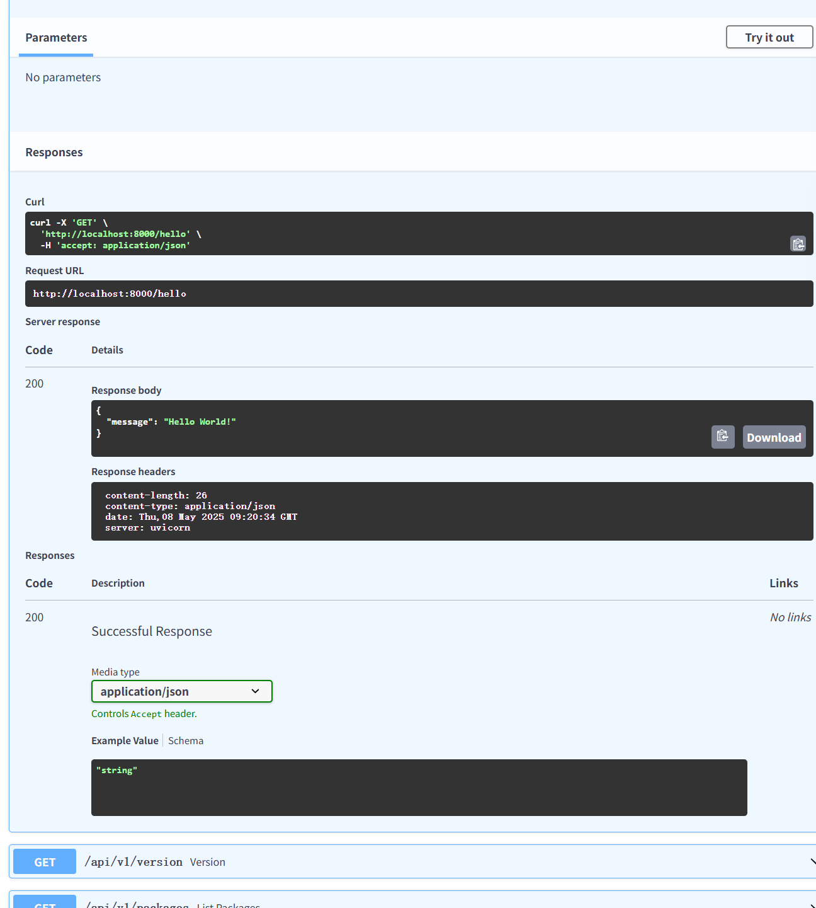

# A FastAPI Example

## Development

The development environment can be setup in a few ways.

```sh
nix-shell
pytest -v
```
```sh
python3 -m venv venv
source venv/bin/activate
pip3 install -r requirements.txt
pip3 install -e .
pytest -v
```

Running the server.

```sh
example-init  # initialize database
uvicorn example.server:app --reload
```

## Docker build

```sh
docker build -it example .
docker run --rm -it example
```
## 术语表截图
  
<!-- by 黄小丽 -->

## API 文档界面
  
<!-- by 黄小丽 -->

## API 文档界面
  
<!-- by 黄小丽 -->